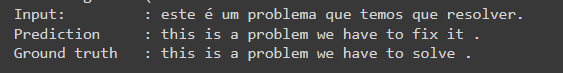
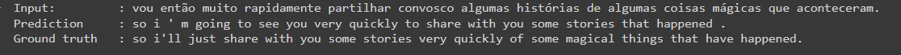
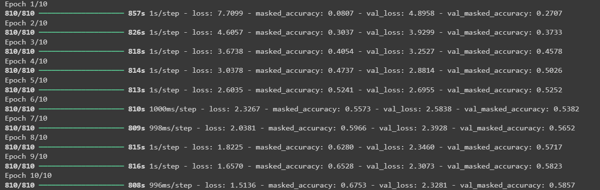
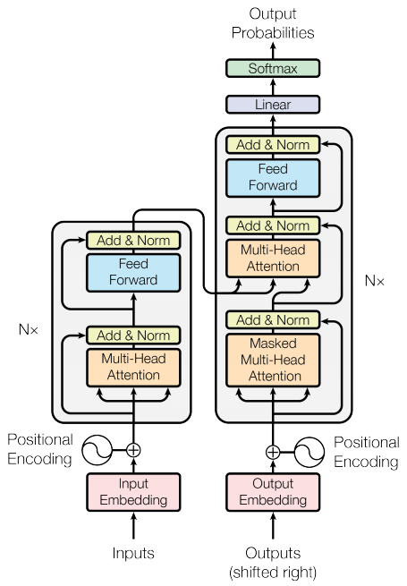
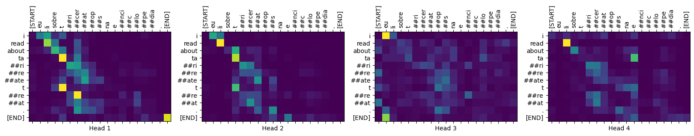

# Projeto de Tradução Automática com Transformers

## Descrição

Este projeto utiliza a arquitetura dos Transformers para realizar tradução automática, implementando uma pipeline completa com inferência. O modelo foi treinado e testado em um conjunto de dados, apresentando resultados satisfatórios na tarefa de tradução entre português e inglês.

## Pontos Positivos

- **Desempenho em Tradução:** O modelo de Transformer se destacou na qualidade das traduções, superando modelos anteriores em precisão e fluência. Isso demonstra a eficácia da arquitetura em capturar nuances linguísticas.
- **Paralelização:** A estrutura do Transformer permite o processamento paralelo das entradas, o que acelera significativamente o treinamento em grandes conjuntos de dados. Essa característica é uma grande vantagem em termos de eficiência.
- **Escalabilidade:** A flexibilidade na arquitetura facilita a adição de camadas e unidades, permitindo a adaptação do modelo para diferentes tarefas e tamanhos de conjuntos de dados.
- **Atenção:** O mecanismo de atenção permite que o modelo foque em partes relevantes da entrada ao gerar a tradução, melhorando a contextualização e a precisão das saídas.

## Pontos Negativos

- **Complexidade:** A implementação da arquitetura Transformer é mais complexa do que as abordagens tradicionais. Isso pode dificultar o entendimento e a manutenção do código, especialmente para quem está começando na área.
- **Necessidade de Dados:** O desempenho do modelo depende fortemente da disponibilidade de grandes volumes de dados rotulados. Em cenários com conjuntos de dados limitados, a eficácia pode ser comprometida.
- **Overfitting:** Devido ao grande número de parâmetros, o risco de overfitting é maior, especialmente em conjuntos de dados pequenos. Isso exige técnicas adicionais de regularização durante o treinamento.
- **Requisitos Computacionais:** A execução e o treinamento de modelos Transformers exigem recursos computacionais significativos, o que pode ser uma barreira para implementações em ambientes com hardware limitado.

## Resultados de Tradução

### Exemplo de Tradução

Aqui está um exemplo da tradução gerada pelo modelo. A entrada é uma frase em português, e a saída é a tradução correspondente em inglês gerada pelo Transformer:

**Entrada:** "este é um problema que temos que resolver."
**Saída:** "this is a problem we have to fix it ."

**Entrada:** "vou então muito rapidamente partilhar convosco algumas histórias de algumas coisas mágicas que aconteceram."
**Saída:** "so i ' m going to see you very quickly to share with you some stories that happened ."

---

### Treinamento

A imagem abaixa mostra o processo de treinamento do modelo:

---

### Arquitetura do Transformer

Para entender melhor o funcionamento do modelo, aqui está uma visualização da arquitetura Transformer que foi implementada:

---

### Attention Weights

Um dos aspectos mais interessantes do modelo Transformer é a capacidade de focar em partes específicas da frase de entrada. A imagem a seguir mostra os pesos de atenção em uma frase de exemplo, indicando como o modelo aloca a importância durante a tradução:

## Conclusão

A experiência com a implementação da arquitetura Transformer para tradução automática proporcionou uma visão profunda dos desafios e vantagens dessa abordagem. A flexibilidade e o desempenho são inegáveis, mas é importante considerar as complexidades e requisitos que vêm junto a essas inovações. O projeto reforçou a necessidade de um equilíbrio entre a sofisticação do modelo e a viabilidade prática de sua aplicação.
